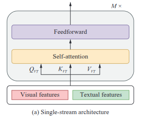
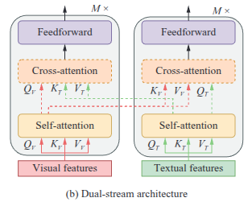
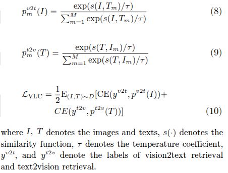
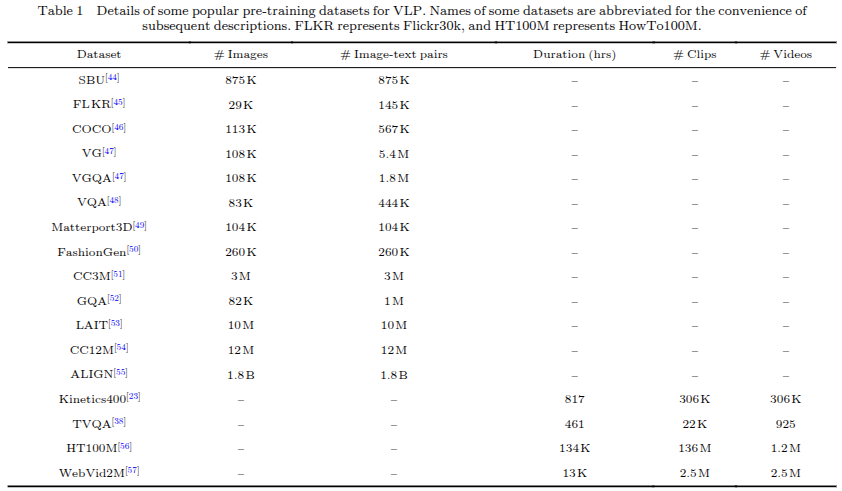
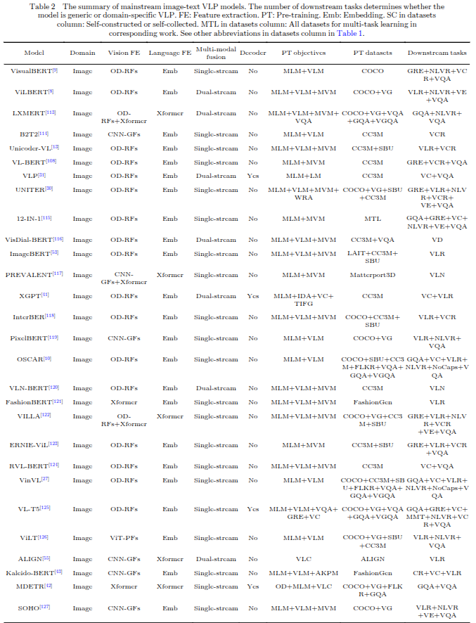
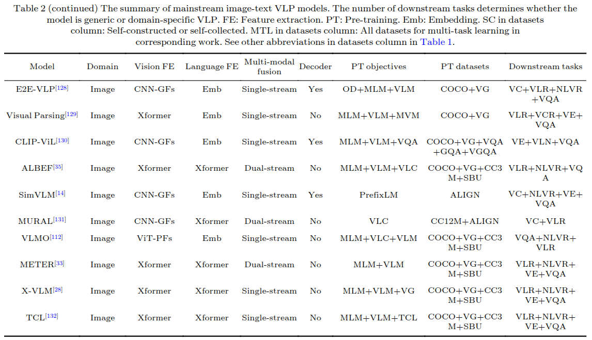
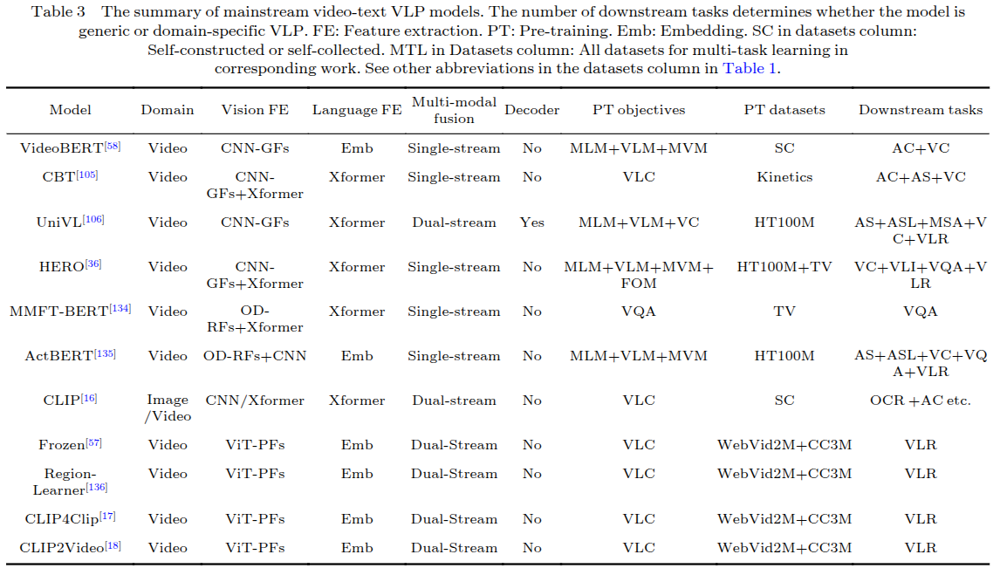

2 Feature extraction

2.1 Feature extraction

2.1.1 Image feature extraction

OD-based region features (OD-RFs):

- OD là object detection

- mô hình object detection được sử dụng nhiều nhất là Faster R-CNN với bottom-up attention

- dù ODFs có performance tốt, nhưng việc extract region features có thể tốn thời gian. Khi huấn luyện mô hình VLP, để giải quyết vấn đề này, thành phần pre-trained object detectors thường để đóng băng => giới hạn khả năng của mô hình VLP 

CNN-based grid features (CNN-GFs)

- có thể huấn luyện VLP cùng với CNNs end-to-end. Cho phép mô hình thích ứng tốt hơn với dữ liệu đầu vào cụ thể, nhưng đòi hỏi tài nguyên tích toán lớn để huấn luyện.

- ngoài ra cũng có thể rời rạc hóa grid features trước bằng một learned vision dictionary, rồi sau đó mới đưa vào cross-modal module. (Ví dụ: thành vì sử dụng embedding biểu diễn ảnh đầu vào, chúng ta phân loại các thành phần trong ảnh trước rồi, những đối tượng được phát hiện này lại được map thành token embedding). Giảm kích thước dữ liệu đầu vào và tăng tốc quá trình xử lý, nhưng có thể mắt đi một phần thông tin chi tiết do rời rạc háo dữ liệu

ViT-based patch features (ViT-PFs)

2.1.2 Video feature extraction

- Với CNN-GFs, VLP có thể sử dụng ResNet pretrained on ImageNet, hoặc Slow-Fast, và I3D pretrained on Kinetics để trích xuất 2D và 3D visual features với mỗi một video frame. Sau đó các features này được concat và đưa vào một fully-connected layer để truyển thành những vector có số chiều bằng token embedding

- Với ViT-PFs, do mô hình thị giác có thể sử dụng chuỗi không có định, video có M frame được chia thành M x N non, overlappting spatio-temporal patches of size PxP, với N = HW/P^2 

2.1.3 Text feature extraction

- sử dụng các kĩ thuật trong BERT, ReBERTa, ALBERT, XLNet để tạo các vector embedding

2.2 Feature representation

VLP có thể đưa visual hoặc text features vào transformer encoder (có thể khởi tạo ngẫu nhiên hoặc tái sử dụng encoder của ViT, DeiT để encode ViT-PFs, sử dụng encoder của BERT (hoặc tương tự) để tạo textual features). Đặt tên chung là Xformer

3 Model architecture

3.1 Single-stream versus dual-stream

Single-stream: 

- text and visual features are concatenated together, then fed into a single transformer block

- parameter-efficient (same set of parameters is used for both modalites)

Dual-stream:

- text and visual features are not cancatednated, but sent to two different transformer blocks independently. These two transformer blocks do not share parameters

- to achieve higher performance, cross-attention is used

- to achieve higher efficiency, there can be also no cross-attention between the visual transformer and textual transformer blocks

3.2 Encoder-only versus encoder-decoder

4 Pre-training objectives

- Completion is to reconstruct the masked element by leveraging the unmasked remainders to understand the modality (Masked language modeling, prefix language modeling, masked vision modeling)

- Matching is to unify the vision and language into a shared hidden space to generate universal vision-language representation (vision-language matching, vision-language contrastive learning, word-region alignment)

- Temporal is to learn good representation by reordering the disrupted input sequence (Frame order modeling)

- Particular types consist of other pre-training objects (such as visual question answering, visual captioning)

4.1 Masked language modeling

4.2 Prefix language modeling: học sinh văn bản hoặc hoàn thiện chuỗi dựa trên một tiền tố cố định

4.3 Masked vision modeling

- Masked features regression

- Masked feature classification

4.4 Vision-language matching

- với single-stream sử cụng special token [CLS], predict là một số từ 0 đến 1, 0 là mismatched, 1 là matched

- với dual-stream sử dụng [CLSv] và [CLSt]

4.5 Vision-language contrastive learning

4.6 Word-region alignment (chưa rõ, cần tìm hiểu thêm)

4.7 Frame order modeling

To better model the timing of the video, VLP models randomly disrupt the order of some input frames and the preidct the actual position of each frame (FOM), is a classification task in practice

4.8 Particular pre-training objects

- visual question answering

- visual captioning

- grounding referring expression (GRE)

- image-conditioned denoising autoencoding (IDA)[41]

- text-conditioned image feature generation (TIFG)[41]

- object detection (OD)[42]

- aligned Kaleido patch modeling (AKPM)

5 Pretraining datasets

5.1 Datasets for image-language pretraining

5.2 Datasets for video-language pretraining 

6 Downstream tasks

Visual question answering

Visual reasoning and compositional question answering

Video-language inference

visual entailment

visual commonsense reasoning

natural language for visual reasoning (NL-VR)

Grounding referring expressions 

Category recognition

Multi-modal sentiment analysis

vision-language retrieval

visual captioning

novel object captioning at scale (NoCaps)

Visual dialogue

Multi-modal machine translation

vision-language navigation

optical character recognition

7 SOTA VLP models

Image-text VLP models

- VisualBERT

- VDBERT

- VLMO

- METER

Video-text VLP models

VideoBERT

CLIP4Clip

CLIP2Video

8 Conclusions and new frontiers

Incorporating acoustic information

Knowledgeable and cognitive learning

Prompt tuning

Model compression and acceleration

Out-of-domain pre-training

Advanced model architecture